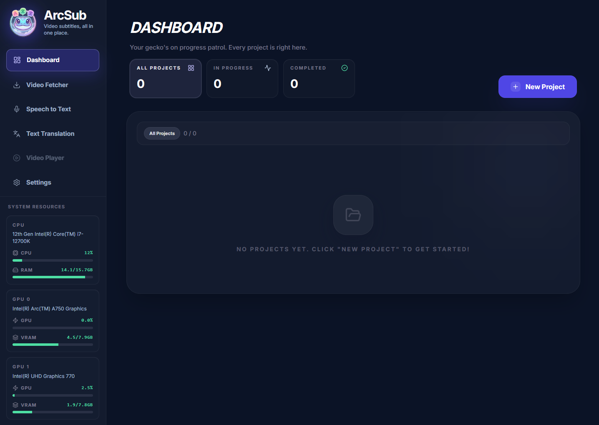
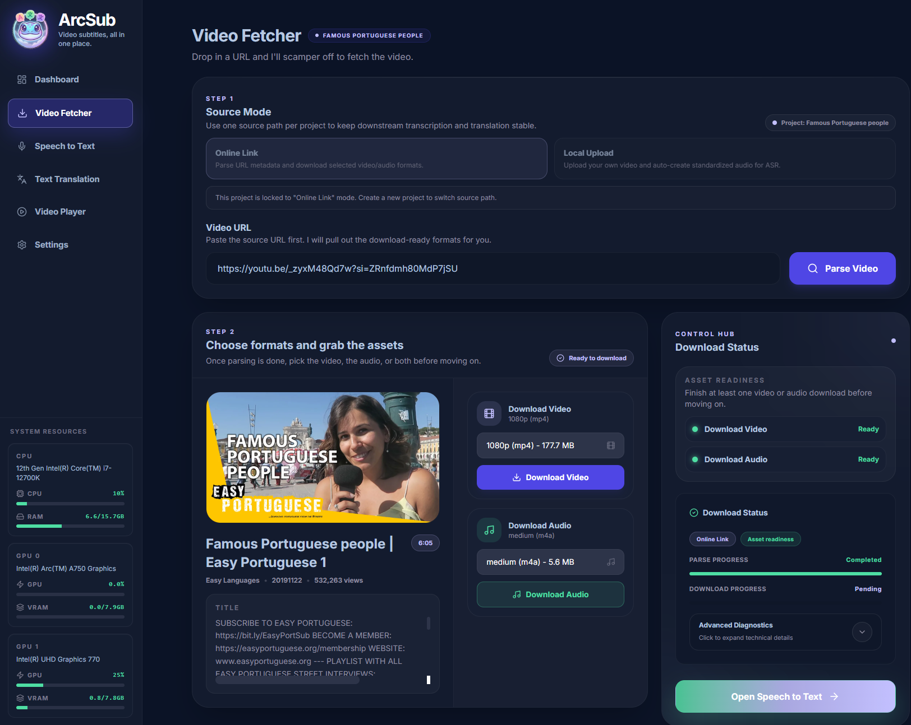
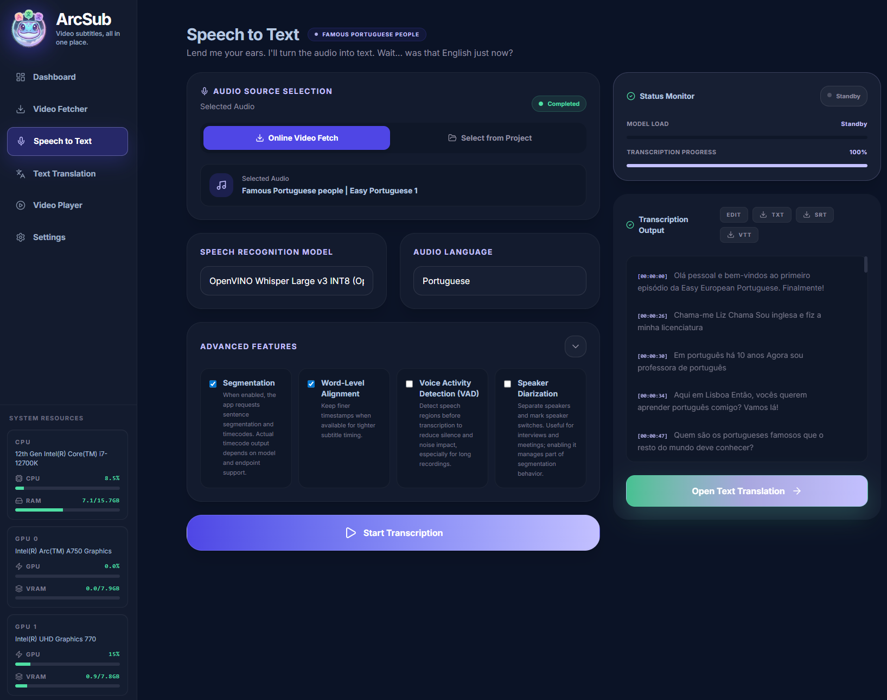
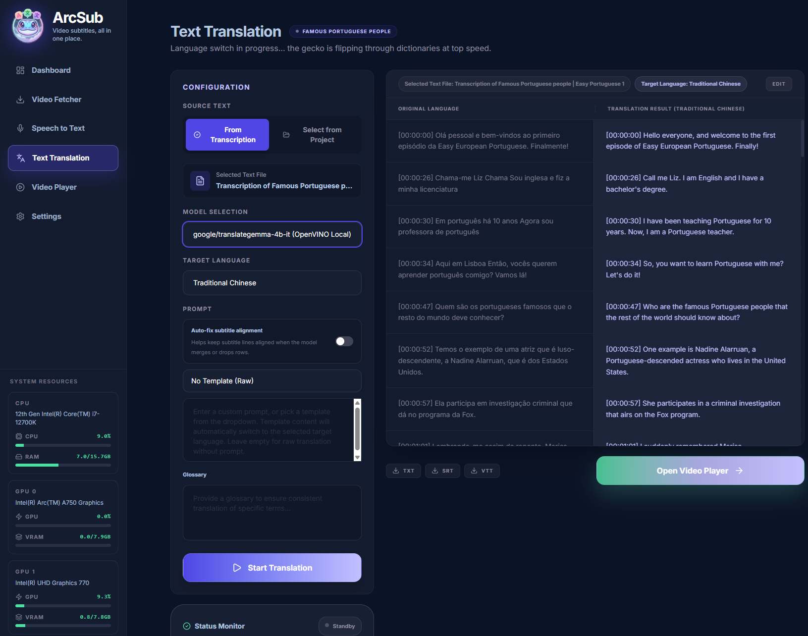

# ArcSub

ArcSub ist eine durchgängige Workstation für die Untertitelübersetzung, die Cloud-Dienste und lokale OpenVINO-Modelle gleichwertig behandelt. Sie umfasst die Medienaufnahme, die Spracherkennung, die Untertitelübersetzung und die Wiedergabe der fertigen Untertitel zusammen mit dem Video.

## Sprachen

- English: [README.md](./README.md)
- 繁體中文: [README.zh-TW.md](./README.zh-TW.md)
- 日本語: [README.ja.md](./README.ja.md)
- Deutsch: [README.de.md](./README.de.md)

## Dokumentation

- English: [docs/en/getting-started.md](./docs/en/getting-started.md)
- 繁體中文: [docs/zh-TW/getting-started.md](./docs/zh-TW/getting-started.md)
- 日本語: [docs/ja/getting-started.md](./docs/ja/getting-started.md)

## Screenshots

Dashboard-Übersicht: Untertitelprojekte verwalten, Systemressourcen überwachen und den gesamten Workflow durchlaufen.

Video Fetcher: Quellmetadaten analysieren, herunterladbare Formate auswählen und Assets für die Transkription vorbereiten.

Spracherkennung: Wählen Sie ein Cloud- oder lokales Erkennungsmodell, konfigurieren Sie erweiterte Funktionen und generieren Sie eine Transkriptausgabe.

Textübersetzung: Wählen Sie ein Cloud- oder lokales Übersetzungsmodell, konfigurieren Sie die Sprachoptionen und vergleichen Sie die Quell- und die übersetzten Untertitel.

Videoplayer: Sehen Sie sich die fertigen Untertitel zusammen mit dem Video an und optimieren Sie die Untertitelformatierung für die Wiedergabeseite.

## Schnellzugriff

### Downloads

Wenn Pakete für dieses Repository veröffentlicht werden, laden Sie das neueste Archiv für Ihr Betriebssystem von [Releases](../../releases/latest) herunter.

### Paketversion

Für die normale Endbenutzernutzung starten Sie ArcSub über die Paketversion:

- Windows
  - `deploy.ps1`
  - `start.production.ps1`
- Linux
  - `deploy.sh`
  - `start.production.sh`

Beginnen Sie mit:

- [docs/en/installation.md](./docs/en/installation.md)
- [docs/en/usage.md](./docs/en/usage.md)
- [docs/en/faq.md](./docs/en/faq.md)

### Quellcodeentwicklung

Wenn Sie mit diesem Repository arbeiten:

- Windows
  - `npm install`
  - `.\start.ps1`
- Linux
  - `npm install`
  - `./start.sh`

Die Hilfsprogramme `start.ps1` und `start.sh` bereinigen veraltete Entwicklungsprozesse und starten dann `npm run dev`.

## Repository-Bereich

Dieses Repository enthält den Quellcode der Anwendung und die öffentliche Dokumentation.

Es enthält nicht:

- lokale Laufzeitdaten unter `runtime/`
- heruntergeladene lokale ASR- oder Übersetzungsmodelle
- portable Bootstrap-Laufzeitumgebungen wie `.arcsub-bootstrap/`
- persönliche Anmeldeinformationen wie `.env`

## Hauptfunktionen

- Lokale Medien importieren oder Online-Medien herunterladen
- Spracherkennung mit Cloud-ASR-Diensten oder lokalen OpenVINO-ASR-Modellen
- Wortausrichtung, VAD und Hilfsfunktionen für die Sprechblasensteuerung nutzen
- Untertitel mit Cloud-Übersetzungsdiensten oder lokalen OpenVINO-Übersetzungsmodellen übersetzen
- Untertitel zusammen mit dem Video anzeigen und das Styling für die Anzeigeseite anpassen

## Cloud- und lokale Modelle

ArcSub ermöglicht es jedem Projekt, den optimalen Modellpfad zwischen Cloud-Diensten und lokalen OpenVINO-Laufzeitumgebungen auszuwählen:

- Cloud-ASR- und Übersetzungsmodelle werden in den Einstellungen mit API-Endpunkten, Schlüsseln und Anbieteroptionen konfiguriert.
- Lokale ASR- und Übersetzungsmodelle werden über die Einstellungen installiert und über den mitgelieferten OpenVINO-Laufzeitpfad ausgeführt.
- Die Modellreihenfolge in den Einstellungen bestimmt das Standardmodell für die Spracherkennung und Textübersetzung.
- Die Sprecherdiarisierung von pyannote verwendet Hugging Face-Assets, sofern aktiviert; ein fehlendes Token blockiert weder den normalen Start noch Cloud-Workflows.

## Weitere Dokumente

- Dokumentenindex: [docs/README.md](./docs/README.md)
- Versionen: [Releases](../../releases/latest)
- Diskussionen: [Discussions](../../discussions)
- Mitwirken: [CONTRIBUTING.md](./CONTRIBUTING.md)
- Verhaltensregeln: [CODE_OF_CONDUCT.md](./CODE_OF_CONDUCT.md)
- Sicherheit: [SECURITY.md](./SECURITY.md)

## Lizenz

Dieses Projekt ist unter der [MIT-Lizenz](./LICENSE) lizenziert.
